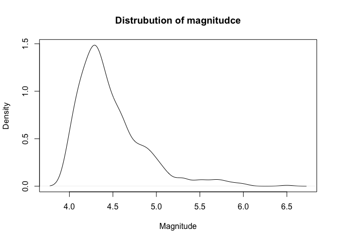

# Lab5PKG

<!-- badges: start -->

[](https://github.com/kanneb/Lab5PKG/actions/workflows/R-CMD-check.yaml)
<!-- badges: end -->

Lab5PKG is a R package for fetching earthquake data from the USGS
Earthquake Catalog API. It will return earthquake data from a specific
continent with a specified timeperiod and a minimum magnitude.

## Installation

Install from GitHub. Set the option first if you also want the vignette:

``` r
# install.packages("pak")
options(pkg.build_vignettes = TRUE)
pak::pak("https://github.com/kanneb/Lab5PKG.git")
```

## Example

This is an example of how the package works:

``` r
library(Lab5PKG)
library(httr2)
library(utils)

df <- earthquake(region = "Africa", starttime = "2020-01-01", endtime = "2021-01-01", min_magnitude = 4)

# Showing the first 10 observations of the earthquake data
head(df, 10)
#>                        time latitude longitude depth mag magError
#> 1  2020-12-31T20:19:33.191Z -14.1143   47.8543    10 4.3    0.147
#> 2  2020-12-31T15:33:40.693Z -14.2331  -13.7432    10 4.6    0.151
#> 3  2020-12-30T21:58:16.073Z  -1.2508  -13.6612    10 4.7    0.138
#> 4  2020-12-29T23:34:57.647Z  -0.7603  -21.1005    10 5.7    0.065
#> 5  2020-12-29T08:06:09.922Z  34.7091   24.0697    10 4.9    0.052
#> 6  2020-12-27T15:56:52.826Z  31.5521   49.5869    10 4.4    0.108
#> 7  2020-12-27T01:59:14.699Z  35.4318   23.1985    10 4.1    0.146
#> 8  2020-12-24T22:22:45.650Z  16.2615   37.5082    10 4.4    0.082
#> 9  2020-12-21T03:04:48.206Z  28.9624   47.5725    10 4.3    0.080
#> 10 2020-12-18T01:04:04.699Z  35.5920   26.2796    10 4.2    0.235
#>                              place  rms       type
#> 1  81 km SW of Ambanja, Madagascar 0.62 earthquake
#> 2      southern Mid-Atlantic Ridge 0.58 earthquake
#> 3        north of Ascension Island 0.67 earthquake
#> 4       central Mid-Atlantic Ridge 0.72 earthquake
#> 5        14 km S of Kastrí, Greece 1.12 earthquake
#> 6       30 km N of R?mhormoz, Iran 1.10 earthquake
#> 7      41 km W of Kíssamos, Greece 1.29 earthquake
#> 8   88 km NNW of Ak’ordat, Eritrea 0.76 earthquake
#> 9   42 km SSW of Al Jahr?’, Kuwait 0.78 earthquake
#> 10   43 km N of Palekastro, Greece 0.85 earthquake
```

Visualisation of data can be the following

``` r
plot(density(df$mag), main = "Distrubution of magnitudce", xlab = "Magnitude")
```



# More

The vignette explains every method with examples:

``` r
browseVignettes("Lab5PKG")
```
